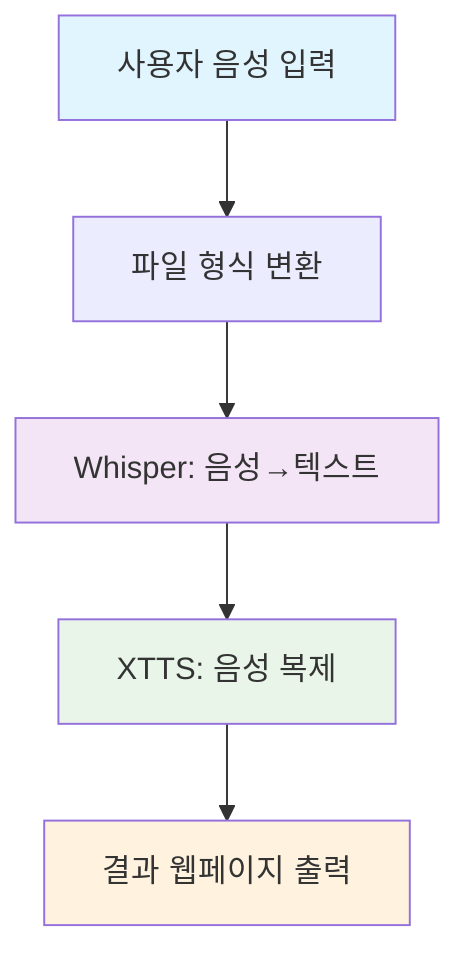

# 🎤 음성 복제 웹 애플리케이션 학습 가이드

> **16세 개발자를 위한 음성 AI 프로젝트 완전 분석**

## 📖 이 프로젝트가 무엇인가요?

우리가 방금 만든 것은 **음성 복제 웹 애플리케이션**입니다! 이 앱은 여러분의 목소리를 녹음하거나 업로드하면, AI가 그 목소리의 특성을 학습해서 같은 목소리로 다시 말해주는 신기한 프로그램입니다.

### 🎯 핵심 기능
- 🎙️ **실시간 음성 녹음**: 브라우저에서 바로 녹음 가능
- 📁 **파일 업로드**: MP3, WAV 등 다양한 음성 파일 지원
- 🧠 **음성 인식**: AI가 말한 내용을 텍스트로 변환
- 🎭 **음성 복제**: 원본 목소리 특성으로 새로운 음성 생성
- 🌐 **웹 인터페이스**: 예쁜 웹페이지에서 쉽게 사용

---

## 🔧 기술 스택 분석

### 백엔드 (서버 쪽)
```python
Flask          # 웹 서버 프레임워크
Whisper        # OpenAI의 음성인식 AI
Coqui TTS      # 음성 합성 (Text-to-Speech)
FFmpeg         # 오디오 변환 도구
```

### 프론트엔드 (웹페이지 쪽)
```javascript
HTML5 Audio API    # 브라우저 녹음 기능
Canvas API         # 음성 시각화
Fetch API          # 서버와 통신
CSS3 애니메이션     # 예쁜 디자인
```

---

## 🧠 AI 모델들이 하는 일

### 1. Whisper (음성 → 텍스트)
```
음성 파일 → [Whisper AI] → "안녕하세요, 저는 김철수입니다"
```
- **역할**: 사람의 말을 텍스트로 변환
- **특징**: 한국어, 영어 등 다국어 지원
- **모델 크기**: tiny(39MB) → base(142MB) → large(2.9GB)

### 2. XTTS v2 (텍스트 → 음성)
```
텍스트 + 원본음성 → [XTTS AI] → 복제된 음성
```
- **역할**: 특정 사람의 목소리로 텍스트를 읽어줌
- **특징**: 단 몇 초의 샘플로도 목소리 복제 가능
- **용량**: 약 2GB (첫 실행시 자동 다운로드)

---

## 🔄 전체 프로세스 흐름



### 상세 단계별 설명

1. **📥 입력 단계**
   - 사용자가 마이크로 녹음 또는 파일 업로드
   - 브라우저에서 서버로 오디오 데이터 전송

2. **🔄 전처리 단계**
   ```bash
   ffmpeg -i 원본파일 -ar 22050 -ac 1 변환파일.wav
   ```
   - 모든 오디오를 WAV 형식으로 통일
   - 22050Hz 샘플레이트, 모노 채널로 최적화

3. **🧠 AI 처리 단계**
   - **Whisper**: 음성을 텍스트로 변환
   - **XTTS**: 원본 음성의 특성을 분석하여 같은 목소리로 재생성

4. **📤 출력 단계**
   - 원본 오디오와 복제된 오디오를 웹페이지에 표시
   - 추출된 텍스트도 함께 보여줌

---

## 💻 코드 핵심 부분 분석

### 🎙️ 실시간 녹음 기능
```javascript
// 마이크 접근 권한 요청
const stream = await navigator.mediaDevices.getUserMedia({ 
    audio: {
        echoCancellation: true,    // 에코 제거
        noiseSuppression: true,    // 노이즈 제거
        sampleRate: 44100         // 고품질 녹음
    } 
});

// MediaRecorder로 녹음 시작
mediaRecorder = new MediaRecorder(stream);
```

### 🎨 오디오 시각화
```javascript
// 실시간 주파수 분석
analyser.getByteFrequencyData(dataArray);

// Canvas에 막대 그래프로 표시
for (let i = 0; i < dataArray.length; i++) {
    barHeight = (dataArray[i] / 255) * canvas.height;
    canvasCtx.fillRect(x, canvas.height - barHeight, barWidth, barHeight);
}
```

### 🐍 Flask 서버 핵심
```python
@app.route('/process_voice', methods=['POST'])
def process_voice():
    # 1. 파일 저장
    audio_file.save(original_path)
    
    # 2. 음성 인식
    result = whisper_model.transcribe(wav_path)
    text = result['text']
    
    # 3. 음성 복제
    subprocess.run(['tts', '--model_name', 'xtts_v2', 
                   '--text', text, '--speaker_wav', wav_path])
```

---

## 🚀 발전 방향 및 개선 아이디어

### 🎯 초보자용 개선사항
1. **언어 선택 기능 추가**
   ```python
   # 한국어 지원 추가
   '--language_idx', 'ko'  # 영어: 'en', 한국어: 'ko'
   ```

2. **음성 품질 옵션**
   ```python
   # 모델 선택 옵션
   models = ['tiny', 'base', 'small', 'medium', 'large']
   whisper_model = whisper.load_model(selected_model)
   ```

3. **실시간 번역 기능**
   ```python
   # 구글 번역 API 연동
   from googletrans import Translator
   translator = Translator()
   translated = translator.translate(text, dest='en').text
   ```

### 🎯 중급자용 도전과제
1. **감정 분석 추가**
   ```python
   # 음성의 감정 상태 분석
   import librosa
   emotion = analyze_emotion(audio_features)
   ```

2. **여러 목소리 저장**
   ```python
   # 사용자별 음성 프로필 저장
   voice_profiles = {
       'user1': 'voice1.wav',
       'user2': 'voice2.wav'
   }
   ```

3. **실시간 스트리밍**
   ```javascript
   // WebSocket으로 실시간 처리
   const socket = io();
   socket.emit('audio_chunk', audioData);
   ```

### 🎯 고급자용 확장기능
1. **모바일 앱 개발**
   ```dart
   // Flutter로 크로스플랫폼 앱
   // React Native로 네이티브 앱
   ```

2. **AI 모델 직접 훈련**
   ```python
   # 자신만의 TTS 모델 훈련
   # 커스텀 Whisper 모델 파인튜닝
   ```

3. **음성 변조 기능**
   ```python
   # 목소리 톤, 속도, 피치 조절
   # 로봇 목소리, 외계인 목소리 등
   ```

---

## 🛠️ 실습 과제

### 과제 1: 기본 커스터마이징 (⭐)
- 웹페이지 색상 테마 변경하기
- 새로운 언어 지원 추가하기
- 처리 시간 최적화하기

### 과제 2: 기능 추가 (⭐⭐)
- 음성 속도 조절 기능
- 여러 목소리 스타일 선택
- 음성 파일 다운로드 기능

### 과제 3: 고급 기능 (⭐⭐⭐)
- 실시간 음성 채팅방 만들기
- AI 성우 서비스 구축하기
- 음성 게임 캐릭터 만들기

---

## 📚 추가 학습 자료

### 🎓 AI/ML 기초
- **머신러닝 기초**: Coursera Andrew Ng 강의
- **딥러닝 입문**: "밑바닥부터 시작하는 딥러닝" 책
- **음성 처리**: librosa 라이브러리 튜토리얼

### 💻 웹 개발
- **Flask 심화**: Flask Mega-Tutorial
- **JavaScript 고급**: MDN Web Docs
- **CSS 애니메이션**: CSS-Tricks 가이드

### 🔧 개발 도구
- **Git/GitHub**: 버전 관리 시스템
- **Docker**: 컨테이너 기술
- **AWS/GCP**: 클라우드 배포

---

## 🎉 마무리

축하합니다! 여러분은 이제 **최신 AI 기술을 활용한 음성 복제 애플리케이션**을 완전히 이해하고 있습니다. 

### 배운 것들
✅ AI 모델 (Whisper, TTS) 사용법  
✅ 웹 개발 (Flask, HTML, JavaScript)  
✅ 오디오 처리 (FFmpeg, Web Audio API)  
✅ 사용자 인터페이스 설계  
✅ 파일 업로드/다운로드 시스템  

### 다음 단계
1. **본인만의 아이디어 추가해보기**
2. **GitHub에 프로젝트 올리기**
3. **친구들과 공유하고 피드백 받기**
4. **더 복잡한 AI 프로젝트 도전하기**

> **💡 팁**: 프로그래밍은 계속 시도하고 실패하면서 배우는 것입니다. 에러가 나도 포기하지 말고, 문제를 하나씩 해결해 나가세요!

**화이팅! 🚀**
